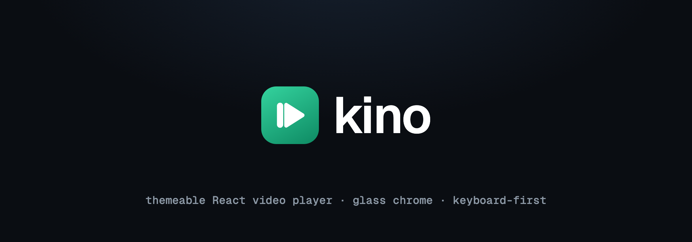
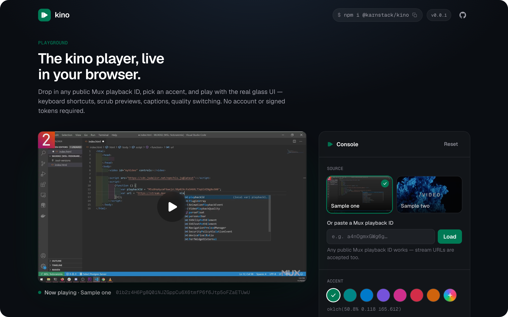

<p align="center">
  
</p>

<p align="center">
  A themeable React video player with a pluggable-provider architecture —
  translucent glass chrome, keyboard-first controls, and a small typed surface.
  Mux, raw files, and YouTube are built in.
</p>

<p align="center">
  <a href="https://www.npmjs.com/package/@karnstack/kino"></a>
  &nbsp;
  <a href="./LICENSE"></a>
  &nbsp;
  <a href="https://kino.karnstack.com"></a>
</p>

<p align="center">
  <a href="https://kino.karnstack.com">
    
  </a>
</p>

> **[Try it live → kino.karnstack.com](https://kino.karnstack.com)** — drop in any public Mux playback ID, pick an accent, and play with the real glass UI.

kino ships the player UI and a provider contract. Each provider adapts a streaming engine to that contract, so the same glass chrome can sit on top of different backends. Five providers ship today: **Mux** (adaptive HLS via `@mux/mux-video`), **Native** (a plain `<video>` over any raw file URL), **YouTube** (the IFrame Player API wrapped in the same chrome), **Vimeo** (the Vimeo Player SDK under the same chrome), and **Scenes** (audio-driven React scene sequences in an iframe under the same chrome). Each lives behind its own entry point, so you only pull in the engine you use.

## Install

```sh
pnpm add @karnstack/kino
```

The Mux engine (`@mux/mux-video`) is pulled in transitively, so you do not install it yourself. React 19 is a peer dependency (`react` and `react-dom` `>=19`).

## Quick start

```tsx
import { MuxPlayer } from "@karnstack/kino/mux"
import "@karnstack/kino/styles.css"

export function Clip() {
  return (
    <MuxPlayer
      playbackId="your-playback-id"
      tokens={{ playback, thumbnail, storyboard }}
      accentColor="oklch(50.8% 0.118 165.612)"
    />
  )
}
```

Give the player a sized container. It fills `100%` width and height of its parent, so wrap it in an element with the aspect ratio or dimensions you want.

### Tokens are passed in

kino is auth-agnostic. For signed playback you mint the `playback`, `thumbnail`, and `storyboard` tokens server-side and hand them to the player through the `tokens` prop. The player never holds a signing key and never talks to your auth layer; it only appends the tokens you give it to the media, thumbnail, and storyboard URLs. For public playback you can omit `tokens` entirely.

### Blur-up placeholder

Before the poster and first frame load, the video box is empty. Pass a small `placeholder` (a base64 data URI or a URL) and kino paints it behind the video as a blur-up; the sharp poster covers it once decoded, and it reappears briefly across source swaps.

```tsx
<MuxPlayer playbackId="..." placeholder={blurDataUrl} />
```

The poster itself stays the signed Mux thumbnail (kino derives it from `playbackId` + the `thumbnail` token), so `placeholder` is purely the instant low-res layer underneath.

## Playing a raw URL

For a plain media URL (mp4, webm, ogg, …) — no Mux account or HLS engine — use the native provider. It puts the same glass chrome over a native `<video>` element, so this entry pulls in none of the Mux engine.

```tsx
import { NativePlayer } from "@karnstack/kino/native"
import "@karnstack/kino/styles.css"

export function Clip() {
  return (
    <div style={{ aspectRatio: "16 / 9" }}>
      <NativePlayer
        src="https://example.com/clip.mp4"
        poster="https://example.com/clip.jpg"
        accentColor="oklch(50.8% 0.118 165.612)"
      />
    </div>
  )
}
```

Pass sidecar subtitles/captions via `tracks`, and kino renders the cues in its own styled overlay:

```tsx
<NativePlayer
  src="https://example.com/clip.mp4"
  tracks={[
    {
      src: "https://example.com/en.vtt",
      srclang: "en",
      label: "English",
      default: true,
    },
  ]}
/>
```

`NativePlayer` also takes `autoPlay`, `muted`, `loop`, `defaultRate`, and `crossOrigin` (set the last when the media or a caption track is cross-origin). Quality switching hides itself since a raw file carries no rendition ladder.

## Playing a YouTube video

For a YouTube source, use the YouTube provider. It drives the YouTube IFrame Player API under the same glass chrome, with kino owning the controls and keyboard map (the native YouTube UI is hidden).

```tsx
import { YouTubePlayer } from "@karnstack/kino/youtube"
import "@karnstack/kino/styles.css"

export function Clip() {
  return (
    <div style={{ aspectRatio: "16 / 9" }}>
      <YouTubePlayer
        videoId="dQw4w9WgXcQ"
        accentColor="oklch(50.8% 0.118 165.612)"
      />
    </div>
  )
}
```

`videoId` accepts a bare id or any `watch`, `youtu.be`, `embed`, or `shorts` URL — kino resolves it (the `parseYouTubeId` helper is exported if you want it directly). It also takes `autoPlay`, `muted`, `loop`, `defaultRate`, and `metadata`.

Speed, fullscreen, and captions work. The captions menu lists the video's own subtitle tracks; YouTube renders the cues itself inside the embed, so they appear in YouTube's style rather than kino's caption overlay.

kino plays YouTube through the official IFrame Player API and, per YouTube's terms, **doesn't obscure the player**: before playback and while paused, YouTube shows its own thumbnail, play button, title, and logo, and kino's controls sit alongside them. A few things the API simply doesn't expose, so kino hides those controls: **manual quality** (YouTube dropped it — playback is always automatic), **picture-in-picture**, and **scrub-preview thumbnails** (storyboards aren't available to embeds).

## Playing a Vimeo video

For a Vimeo source, use the Vimeo provider. It drives the Vimeo Player SDK under the same glass chrome, with kino owning the controls and keyboard map.

```tsx
import { VimeoPlayer } from "@karnstack/kino/vimeo"
import "@karnstack/kino/styles.css"

export default function Watch() {
  return <VimeoPlayer videoId="291235566" accentColor="#00adef" />
}
```

For an unlisted video, pass the hash (or a share URL that contains it):

```tsx
<VimeoPlayer videoId="123456789" hash="abcdef0123" />
```

Chromeless playback (kino owning the controls) requires a paid Vimeo plan.

## Playing a scene sequence

The scenes provider plays something that is not a video at all: an audio file is the master clock, and a manifest maps time ranges of that audio onto React components ("scenes") rendered as live DOM. kino's chrome scrubs, seeks, captions, and speed-shifts the sequence exactly like any other source, but every frame is resolution-independent DOM instead of pixels.

A scene sequence has two halves:

- **In your app**, `ScenesPlayer` puts the glass chrome over an iframe and drives it through a small `postMessage` protocol. (`createScenesProvider` is the underlying provider if you want custom chrome.)
- **In the iframe** (the "host page"), `createSceneHost` owns the `<audio>` element and the scene DOM. It lazy-loads scene modules, preloads the next scene while the current one plays, scales a fixed 1920x1080 stage to the viewport, and streams playback state back to the parent.

```tsx
import { ScenesPlayer } from "@karnstack/kino/scenes"
import "@karnstack/kino/styles.css"

export function Watch() {
  return (
    <div style={{ aspectRatio: "16 / 9" }}>
      <ScenesPlayer
        src="https://scenes.example.com/host?sequence=intro&token=..."
        captions={{
          src: "https://scenes.example.com/intro.vtt",
          label: "English",
          srclang: "en",
        }}
        accentColor="oklch(50.8% 0.118 165.612)"
      />
    </div>
  )
}
```

`src` is the full host page URL with any auth token already encoded; as everywhere else in kino, the player never talks to your auth layer. `ScenesPlayer` also takes `defaultRate`, `autoPlay`, `muted`, and the shared chrome props (`accentColor`, `theme`, `className`, `placeholder`, `children`). `metadata` is accepted for parity with the other players but is reserved and currently unused. Options are read once per `src`; when `src` changes the component remounts internally, rebuilding the iframe from scratch.

Captions are a sidecar VTT fetched and rendered by the parent in kino's own caption overlay, so the host page never deals with text tracks.

kino sets `allow="autoplay; fullscreen"` on the iframe it creates. That delegates the parent page's user activation (the click on kino's play button) into the frame; without it, `audio.play()` inside the host is blocked by autoplay policy. If your app itself runs inside an iframe, the outer frame needs the same `allow` list.

### The host page

The host page is a page you serve from anywhere (same origin or not) that bundles the sequence's scene components and boots the host runtime:

```tsx
import { createSceneHost } from "@karnstack/kino/scenes"
import manifest from "./manifest"

createSceneHost({
  container: document.getElementById("stage")!,
  manifest,
  loadScene: (id) => import(`./scenes/${id}.tsx`),
  // Origin of the embedding page: targets outgoing posts and filters
  // incoming commands. Defaults to "*"; lock it down in production.
  parentOrigin: "https://app.example.com",
})
```

The demo ships a runnable reference: [`demo/scenes-host.html`](demo/scenes-host.html) + [`demo/src/scenes-host.tsx`](demo/src/scenes-host.tsx) is a complete host page (scenes, manifest, boot), and [`demo/scenes.html`](demo/scenes.html) + [`demo/src/scenes-demo.tsx`](demo/src/scenes-demo.tsx) embeds it with `ScenesPlayer`.

`loadScene` resolves a scene id to a module whose default export is the scene component (`SceneModule`). Inside a scene, `useSceneTimeline()` returns the scene clock: `t` is scene-local seconds, and `cue(id)`, `between(from, to)`, `progress()`, and `currentWord()` are all pure over it, so a scene's output is a function of time and scrubbing just works.

```tsx
import { useSceneTimeline } from "@karnstack/kino/scenes"

export default function Intro() {
  const clock = useSceneTimeline()
  return <h1 style={{ opacity: clock.cue("title") ? 1 : 0 }}>Hello</h1>
}
```

### The manifest

The manifest describes the whole sequence: audio sources, total duration, and the scene list with global time ranges.

```ts
type SceneManifest = {
  version: 1
  slug: string
  title?: string
  duration: number // total sequence length in seconds
  scenes: Array<{
    id: string
    src: string // informational; the host loads modules via loadScene
    start: number // global seconds, inclusive
    end: number // global seconds, exclusive
    cues: Cues // named cue marks + word timings for this scene
  }>
  audio: Array<{ bitrate: number; src: string }>
  captions?: string
  poster?: string
  chapters?: Array<{ id: string; title: string; start: number }>
}
```

A scene owns `[start, end)` on the sequence clock. `end` includes the trailing silence after the scene's narration; the scene-local clock clamps to the narration length, so the scene holds its final settled state through the gap. Scenes should tile the clock with no gaps; the host warns once at startup if they do not. `src` records where a scene module lives for tooling, but the host actually loads modules through the `loadScene` callback.

### The wire protocol

The two halves speak a `postMessage` protocol namespaced with `kino:`, so the host page can share a window with unrelated message traffic. You only touch it if you build a custom host. The parent accepts events only from its own iframe's origin and window; the host accepts commands only from its parent window, drops them when their origin does not match a locked-down `parentOrigin`, and targets `parentOrigin` when posting.

| Message                                             | Direction     | Meaning                                                                       |
| --------------------------------------------------- | ------------- | ----------------------------------------------------------------------------- |
| `kino:ready`                                        | host → parent | The host booted; carries the sequence duration.                               |
| `kino:init`                                         | parent → host | Reply to `kino:ready`: initial rate, volume, mute, and autoplay intent.       |
| `kino:play` / `kino:pause` / `kino:seek`            | parent → host | Transport. `kino:seek` carries a global time in seconds.                      |
| `kino:setRate` / `kino:setVolume` / `kino:setMuted` | parent → host | Mirror the corresponding chrome controls.                                     |
| `kino:state`                                        | host → parent | Full media snapshot, ~10Hz while playing and immediately on every transition. |
| `kino:scenechange`                                  | host → parent | The active scene mounted. Fires for the initial scene too, not only on swaps. |
| `kino:error`                                        | host → parent | The audio failed, or a scene module failed to load.                           |

`kino:state` snapshots are authoritative: the parent applies them wholesale, patching time optimistically between ticks so the scrubber tracks the pointer, and holding a just-set rate until the host echoes it back so a stale snapshot cannot flicker the speed menu. A scene module that fails to load posts `kino:error` once and is memoized as failed for the life of the host; nothing retries it. Recovery is rebuilding the iframe, which is exactly what changing `src` on `ScenesPlayer` does.

### Scrubbing and animations

kino stays motion-agnostic, but scrubbing a sequence built on an animation library needs one hook: while a seek is in flight, scenes should snap to settled states instead of replaying their entrances. `createSceneHost` exposes `onSeekingChange` for exactly this. With Motion:

```ts
import { MotionGlobalConfig } from "motion/react"

createSceneHost({
  // ...
  onSeekingChange: (seeking) => {
    MotionGlobalConfig.skipAnimations = seeking
  },
})
```

Each seek flips the flag on, animations jump to their final values, and once the audio fires `seeked` the flag drops and playback continues with motion.

## Theming

The quickest knob is the `accentColor` prop, which drives the scrubber fill, active menu items, and range controls.

```tsx
<MuxPlayer playbackId="..." accentColor="oklch(50.8% 0.118 165.612)" />
```

For deeper control, every visual is driven by CSS custom properties on the `.kino` root. Override them in your own stylesheet, or pass a `theme` object of property/value pairs to set them inline.

| Custom property         | Default                                       | Role                                          |
| ----------------------- | --------------------------------------------- | --------------------------------------------- |
| `--kino-accent`         | `oklch(50.8% 0.118 165.612)`                  | Accent color (progress, active items, ranges) |
| `--kino-radius`         | `12px`                                        | Corner radius of glass surfaces               |
| `--kino-surface`        | `color-mix(in oklab, black 55%, transparent)` | Glass surface fill                            |
| `--kino-surface-strong` | `color-mix(in oklab, black 70%, transparent)` | Stronger surface (idle play button)           |
| `--kino-border`         | `color-mix(in oklab, white 14%, transparent)` | Hairline borders                              |
| `--kino-text`           | `oklch(98% 0 0)`                              | Primary text and icons                        |
| `--kino-text-dim`       | `color-mix(in oklab, white 65%, transparent)` | Secondary text (timecode)                     |
| `--kino-blur`           | `18px`                                        | Backdrop blur radius                          |
| `--kino-shadow`         | `0 8px 40px rgba(0, 0, 0, 0.45)`              | Surface drop shadow                           |
| `--kino-ease`           | `cubic-bezier(0.22, 1, 0.36, 1)`              | Shared transition easing                      |

```css
.kino {
  --kino-accent: oklch(70% 0.15 250);
  --kino-radius: 16px;
  --kino-blur: 24px;
}
```

## Keyboard shortcuts

The player is keyboard-first. Shortcuts are ignored while a text input, textarea, select, or contenteditable element is focused, and modifier-key combinations (Ctrl/Cmd/Alt) are passed through.

| Key           | Action                                        |
| ------------- | --------------------------------------------- |
| `Space` / `K` | Play / pause                                  |
| `<` / `>`     | Decrease / increase playback rate (0.25 step) |
| `M`           | Toggle mute                                   |
| `C`           | Toggle captions                               |
| `S`           | Open the speed menu                           |
| `F`           | Toggle fullscreen                             |
| `0`-`9`       | Seek to 0%-90% of the duration                |

## Capability gating

Controls hide themselves when the active provider or platform cannot support them, rather than presenting a dead button. The provider reports a capability set, and each control checks it:

- Quality switching is hidden when the engine exposes no renditions, and is off on iOS where the system owns adaptive playback.
- Custom-chrome fullscreen is off on iOS (the platform uses its native fullscreen for the underlying video element).
- Picture-in-picture is hidden when the browser does not support it.
- The captions menu appears only when the media actually carries subtitle or caption tracks.

## Local development

```sh
pnpm install
pnpm dev        # demo harness at http://localhost:5173
pnpm test       # vitest
pnpm build      # bundle to dist/
pnpm typecheck  # tsc --noEmit
pnpm lint       # eslint
```

`pnpm dev` runs the playground in `demo/` — the real kino glass UI on the Mux provider, playing public sample assets. Paste any public Mux playback ID, switch accent colors, and tweak the corner radius live; no Mux account or signed tokens required. The same playground is deployed at [kino.karnstack.com](https://kino.karnstack.com).

## Roadmap

- AirPlay support
- Chapters
- Documented headless primitives for fully custom chrome

## License

MIT
